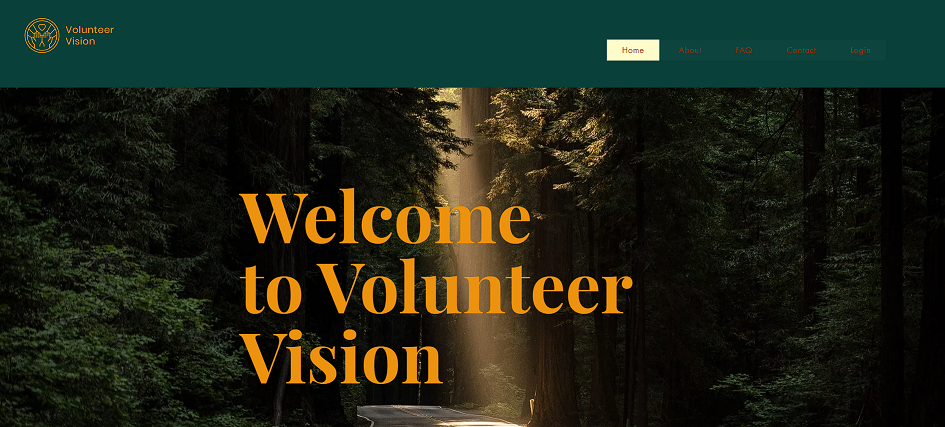
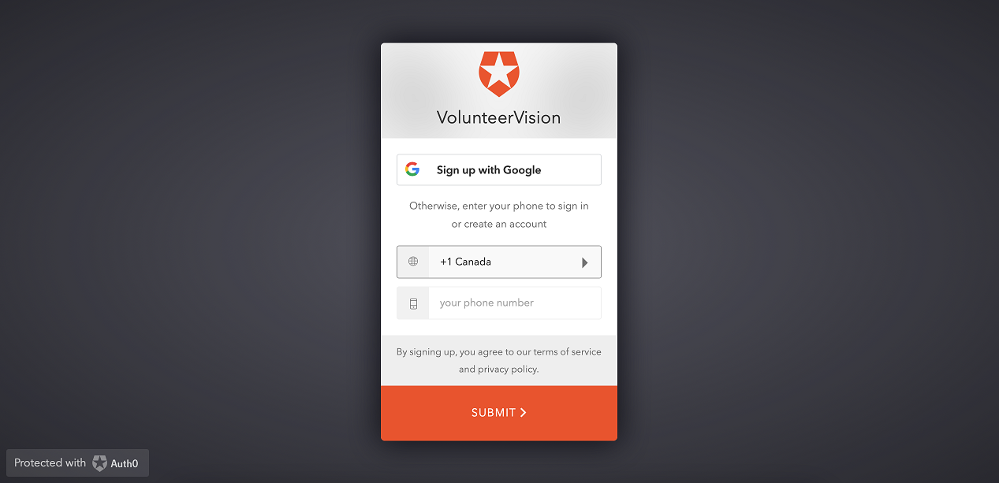

# Volunteer Vision

Volunteer Vision was built in a weekend for [Major League Hacking's](https://mlh.io) CivicHacks Hackathon. 

*🎉 Awarded First Overall!*

## Inspiration

Volunteer Vision was created to inspire individuals to make a positive impact on their community through volunteerism. We believe that every person has the potential to make a difference. By connecting volunteers with local non-profit organizations we can make the process of volunteerism more efficient and effective. This is a project that has the potential to greatly help the local residents and community.

## What it does

Through our user-friendly interface, volunteers can easily create profiles, search for volunteer opportunities and express their interest in specific roles. Organizations can also create profiles, publish volunteering events/projects, and wait for volunteers to apply for them. Our tracking feature allows both volunteers and non-profit organizations to monitor the impact of their volunteer efforts, making it easy for both parties to see the positive change they are making.

## How we built it

To create this project, we used a combination of **Next.js/React, JavaScript, HTML, and CSS, Supabase, Twilio, Auth0, and Wix.** 

Wix was used to create the user-friendly landing page and provided a mobile-responsive interface that is easy to navigate and understand. The Wix landing page contains information such as About and FAQs, which allows users to read more about the purpose of this website. When they are prompted to log-in, they are redirected to our Next.js/React web app.

Next.js/React, along with JavaScript, HTML, and CSS, built the web application. In addition to CSS, we also MaterialUI as our styling library. Next.js allowed seamless integration with Auth0 using the API routes included in the framework. We also integrated Twilio passwordless SMS, allowing using to quickly login without having to worry about password security.

Finally, the Supabase database allows for persistent data for the volunteers, organizations, and projects. The database lets organizations post new volunteer events, and then volunteers can view these projects and apply.

 

## Challenges we ran into

One of the main challenges we ran into was the integration of different technologies. React/Next.js, Auth0, Twilio, Supabase, and Wix required careful coordination to ensure they worked seamlessly together. This required a lot of testing and troubleshooting to ensure everything ran smoothly. 

Another challenge was creating a user-friendly interface that was easy to navigate and understand. Wix made it easy to create a visually pleasing interface, but we had to ensure that it was intuitive and easy to use. 

Using Supabase was a challenge since none of the team members had worked with this database before. Some of our team members were not confident in using relational databases, which made working with them more difficult. However, the documentation was very thorough and we were able to make it work.

Despite these challenges, we overcame them and delivered a platform that connects volunteers with local non-profit organizations.

## Accomplishments that we're proud of

We are proud of several accomplishments that we achieved with this project. One of the main accomplishments is the creation of a project that aims to connect volunteers with local non-profit organizations and make the process of volunteerism more efficient and effective. This was a great idea, and we are glad that we were able to implement it.

Another accomplishment is the user-friendly interface we have created, which makes it easy for volunteers to create profiles, search for volunteer opportunities, and express their interest in specific roles.

We are also proud of how we were able to get all the moving pieces of this project working together, especially because most of our team hadn't worked with a lot of these technologies before. Starting from Wix to Twilio+Auth0, and finally, to the Next.js+Supabase, we used various technologies and created a seamless application. We worked together to troubleshoot errors and find the best solutions to make this project happen. 

All these accomplishments have helped us to bridge the gap between volunteers and local non-profit organizations and make a meaningful impact in our communities through volunteerism.

## What we learned

We developed stronger teamwork, interpersonal, and communication skills. We had team members who had varying levels of experience; the more experienced members got to learn mentorship skills, while the less experienced members learned new skills and best practices from their peers.

As a whole, our team learned about the usage of various tech stacks. As mentioned in the "How We Built It Section" today, we utilized technologies such as Next.js/React, Supabase, JavaScript, HTML, CSS, Twilio, Auth0, and Wix. 

For many of us, this was our first time using Supabase, Twilio, Auth0, and Wix in particular. It was great using them for a practical application.

Although some of the team has used Next.js/React before, this project allowed everyone to gain more practical experience with them.

## What's next for Volunteer Vision

A fully functional mobile app would be our next move - although the Wix application works for every device, the Next.js web application should be optimized for mobile devices. An app would help connect even more people to great causes. We would also like to add a feedback system that allows volunteers and organizations to discuss their experiences and hopefully encourage more people to generously offer their time and skills.

## Screenshots

